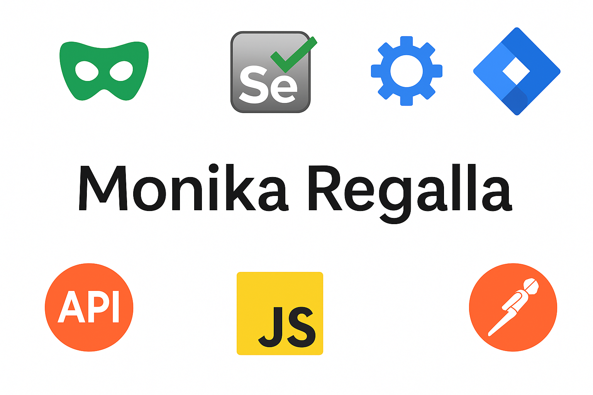

## Hi there 👋


# Monika Reddy Regalla

**QA AUTOMATION ENGINEER**  
📍 Stavangerstrasse 1, 10439 Berlin, Germany  
📧 monika.regalla@gmail.com | 📞 +49 176 76409408  
🌐 [LinkedIn](https://www.linkedin.com/in/monika-regalla-037b38145/)  
📅 DOB: 31/05/1993 | Indian | Visa: Residence Permit  

---

## 🎯 Short Profile

QA Engineer with 7+ years of experience in Automation and Manual testing, with strong knowledge of SDLC and STLC. Skilled in building automation frameworks using Playwright (TypeScript/JavaScript) and experienced in API, Functional/Regression, Integration, and UAT testing across Agile and V Model. Experienced with development workflows, including version control, CI/CD, and leveraging AI to enhance automation efficiency.  Known for strong collaboration, a results driven approach, and a continuous drive to learn new technologies.

---

## 🛠 Technical Skills

- **Automation Tools**: Playwright (TypeScript/JavaScript)  
- **Testing Areas**: REST API Testing, Guidewire Testing, Backend Integration Testing, Manual & Mainframe Testing,  
- **Test Management**: JIRA, HP ALM/QC, Rally, qTest, Confluence, Notion
- **Other Tools**: Postman, Bruno, Ranorex, VSTS, MongoDB

---

## 💼 Experience

### **Enpal Energy GMBH, Berlin**
**QA Automation engineer** 
📅 Aug 2025 – Feb 2026
- Established QA processes from scratch, validating UI, backend services, and external applications while collaborating with different teams.
- Built a regression automation suite using Playwright (TypeScript) and enhanced efficiency with AI assisted tools like Cursor.
- Test Repo and version control using Azure devops.
- Performed Rest API and backend testing using Bruno and MongoDB.
- Tested customer facing web apps, and mobile app.
- Supported tech team by managing support tickets, categorizing issues, and improving quality by identifying recurring flows.

---

### **DXC Technology Pvt Ltd, India**  
**Professional 2 Product Test**  
📅 Sept 2022 – Sept 2023  
- Developed a UI automation framework using Playwright with TypeScript and set up a CI/CD pipeline (GitHub Actions) to enable end to end automation.
- Worked on API testing using PostMan on Salesforce application integrating with UI.
- I90(backend) integration testing with UI.
- Responsible for QA activities, Test/Defect management using Jira, Scrum calls, and Defect triage calls.

---

### **Capgemini Technology Services, India**  
**Senior Consultant**  
📅 Sept 2019 – Aug 2022  
- Worked on Guidewire policy center and claims center web application testing.
- Worked on different functionalities/tools like Rating, Cesar, Z-spire, workbench, Ranorex, Postman, Jira and VSTS.
- Requirements analysis, Test Plan, Test Design and Execution, Test Summary report, and capacity planning.

---

### **Cigniti Technologies, India**  
**QA Engineer – Testing**  
📅 Oct 2017 – Aug 2019  
- Worked on Duckcreek Billing integration project (PURE Insurance)  
- Performed Duckcreek Billing to Policy Center UI testing using Postman  
- Onsite business trip to the U.S. for requirements gathering and training  
- Managed all QA documentation, used qTest, Rally 
- Coordinated with testers/developers across teams for QA activities and bug triages  
- B1/B2 US Visa valid till Dec 2028  

---

### **NTT DATA, India**  
**App Testing and QA Consultant**  
📅 Apr 2016 – Sept 2017  
- Tested Policy Center UI and backend functionality using POS and QWS (mainframes)  
- Worked on rating calculations, Guidewire Claims Center, ACT, Vicctir Bizoops  
- Managed test/defect lifecycle using HP ALM/QC  

---

## 🎓 Academics

- **Bachelor’s in Electronics and Communications**  
  Lakireddy Balireddy College of Engineering, April 2015 – CGPA: 89.4%  
- **Intermediate** – 92%  
- **High School** – 86%

---

## 🏆 Certifications

- ISTQB Foundation Level  
- AINS 21

---

## 🏅 Awards

- On-Spot Award – 2019  
- XtraMile Award – 2021  
- CG Tournament 2022  
  - 🥇 1st Place – Chess  
  - 🎤 Runner-up – Singing

---

## 💬 Languages

- English – Proficient (IELTS Certified)  
- German – B1  
- Hindi – Advanced  
- Telugu – Native

---

## 🎯 Soft Skills

- Communication  
- Leadership  
- Team Collaboration  
- Decision Making

---

## 🌱 Hobbies & Activities

- Playing Chess, Gardening, Singing  
- Member of Capgemini MU4 Diversity team – hosted Women’s Day event  
- Participated in CSR activities  
- Conducted internal training as a Knowledge Anchor

````
